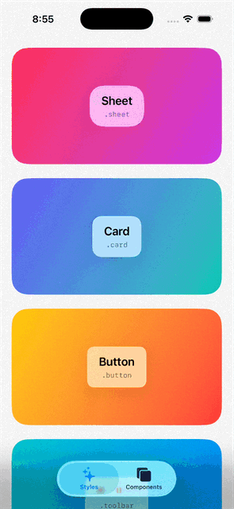
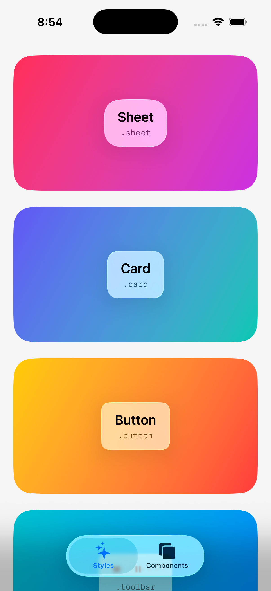
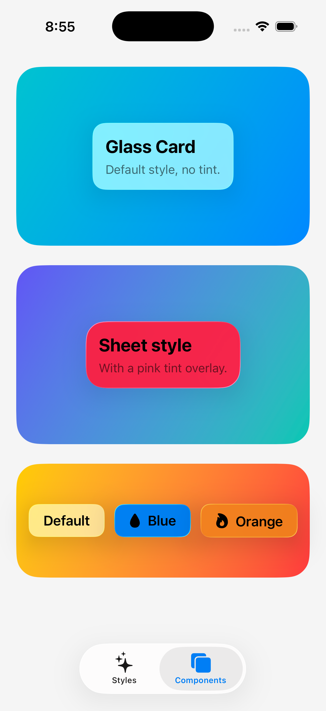

# LiquidGlass

A SwiftUI modifier that brings Apple's iOS 26 Liquid Glass material to any view, with a high-fidelity fallback for iOS 17 and 18.




## Preview

| Styles | Components |
|--------|------------|
|  |  |

## Installation

### Package.swift

```swift
dependencies: [
    .package(url: "https://github.com/rguillen-dev/LiquidGlass.git", from: "0.1.0")
],
targets: [
    .target(
        name: "YourTarget",
        dependencies: ["LiquidGlass"]
    )
]
```

### Xcode

`File ▸ Add Package Dependencies…` and paste:

```
https://github.com/rguillen-dev/LiquidGlass.git
```

## Demo app

A runnable iOS demo lives at [`DemoApp/`](DemoApp). Open
`DemoApp/LiquidGlassDemo.xcodeproj` in Xcode and hit ⌘R — the project pulls in
the local `LiquidGlass` package from this repo via a relative path, so no
remote checkout is needed. Bundle ID `dev.ricardoguillen.LiquidGlassDemo`,
minimum deployment iOS 17.0.

## Quick start

```swift
import SwiftUI
import LiquidGlass

struct NowPlayingCard: View {
    var body: some View {
        VStack(alignment: .leading) {
            Text("Now Playing").font(.headline)
            Text("Synthwave Drive").font(.subheadline)
        }
        .padding()
        .glass(style: .card, tint: .indigo)
    }
}
```

Use the prebuilt components when you want a complete surface:

```swift
GlassCard(tint: .blue) {
    Text("Hello, glass.")
}

GlassButton(tint: .pink) {
    // action
} label: {
    Label("Continue", systemImage: "arrow.right")
}
```

## API reference

### `.glass(style:tint:cornerRadius:)`

| Parameter      | Type            | Default        | Description                                                                |
| -------------- | --------------- | -------------- | -------------------------------------------------------------------------- |
| `style`        | `GlassStyle`    | `.sheet`       | Visual variant. Controls thickness, depth, and default corner radius.      |
| `tint`         | `Color?`        | `nil`          | Low-opacity color overlay applied on top of the material.                  |
| `cornerRadius` | `CGFloat?`      | `nil`          | Overrides the style's default corner radius when provided.                 |

### `GlassStyle`

| Case        | Role                                  | Default corner radius |
| ----------- | ------------------------------------- | --------------------- |
| `.sheet`    | Floating panel, prominent depth        | 24                    |
| `.card`     | Contained surface, medium depth        | 16                    |
| `.button`   | Compact, interactive feel              | 12                    |
| `.toolbar`  | Inline bar element                     | 10                    |
| `.sidebar`  | Full-height navigation surface         | 20                    |
| `.overlay`  | Full coverage, max blur                | 0                     |

### Components

| Type                   | Description                                                                  |
| ---------------------- | ----------------------------------------------------------------------------- |
| `GlassCard`             | Container that wraps content with padding and the glass material.            |
| `GlassButton`           | `Button` styled with the glass material and a press-state animation.         |
| `GlassTabBar`           | Floating bottom navigation bar rendered with the glass material.             |
| `GlassBottomAccessory`  | Persistent glass control docked above a tab bar (e.g. a "now playing" pill). |

### `.glassMorphUnion(id:in:style:tint:cornerRadius:)`

Merges glass surfaces sharing an `id`/`namespace` into one continuous piece of
glass, wrapping the system `glassEffectUnion`. Named to avoid shadowing the
system API — same precedent as `.glassMorphID(_:in:)`.

```swift
@Namespace private var glass

GlassEffectContainer {
    HStack {
        Image(systemName: "play.fill")
            .padding()
            .glassMorphUnion(id: "transport", in: glass, style: .toolbar)
        Image(systemName: "forward.fill")
            .padding()
            .glassMorphUnion(id: "transport", in: glass, style: .toolbar)
    }
}
```

iOS 17–18 have no union primitive, so the fallback reports each participant's
frame via an anchor preference and the enclosing `GlassEffectContainer` draws
one shared surface behind the group — not a `matchedGeometryEffect` fake,
which animates position rather than sampling a shared shape.

> **Kill-switched on iOS 26 too, for now.** Same precedent as
> `GlassEffectContainer`/`.glassMorphID(_:in:)`: this package disabled native
> `GlassEffectContainer` forwarding after a device-only iOS 26.5 rendering
> corruption bug. Whether `glassMorphUnion` forwards to `glassEffect` +
> `glassEffectUnion` on iOS 26+ is gated behind the same shared
> `GlassMaterial.nativeGlassMorphingEnabled` flag as `GlassEffectContainer`
> and `.glassMorphID(_:in:)` (defaults to `false`) — the native path shares
> that same rendering pipeline, and re-enabling it hasn't been verified safe
> on-device. The native forward is still compiled and type-checked against
> the live SDK; only entry into it is gated, so re-enabling later is "flip
> the flag" plus an on-device verification pass. While the flag is `false`,
> this always renders the fallback surface above, on every OS version.

### `.glassBackgroundExtension(isEnabled:)`

Extends a background layer (typically a hero image) under floating glass
chrome instead of getting hard-clipped by it. This is the one deliberate
exception to "glass is navigation-layer only" — it targets the *background*
that chrome floats over, not a general content-glass escape hatch.

```swift
AsyncImage(url: heroURL)
    .resizable()
    .aspectRatio(contentMode: .fill)
    .glassBackgroundExtension()
    .overlay(alignment: .top) {
        GlassTabBar(items: tabs, selection: $tab)
    }
```

Wraps the system `backgroundExtensionEffect(isEnabled:)` on iOS 26+. iOS 17–18
approximate it without ever instantiating the wrapped content twice: the
content itself extends under the safe area via `.ignoresSafeArea()`, and a
gradient-masked feather scrim (drawn from no content pixels of its own) is
overlaid at the top and bottom edges to dissolve that extension into the
floating chrome above it. Reduce Transparency swaps the blurred scrim for a
solid, fully opaque one instead.

### `GlassBottomAccessory`

A persistent glass control docked above a tab bar — the "now playing pill"
pattern that survives navigation between tabs. Wraps `tabViewBottomAccessory`.
The fallback pill wraps its `.glass(...)` surface in its own
`GlassEffectContainer`; it can't share a container with glass surfaces inside
`content` (e.g. a `GlassTabBar` composed via `.customTabBar`), since this
component has no visibility into `content`'s view tree — a known constraint,
not true shared sampling.

```swift
GlassBottomAccessory(tint: .indigo) {
    TabView {
        Tab("Library", systemImage: "books.vertical") { LibraryView() }
        Tab("Search", systemImage: "magnifyingglass") { SearchView() }
    }
} accessory: {
    NowPlayingPill(track: player.currentTrack)
}
```

`GlassBottomAccessory` takes a `GlassBottomAccessoryHost` so it composes
correctly with either a real `TabView` (`.tabView`, the default) or a custom
floating bar like `GlassTabBar` (`.customTabBar`, which has no `TabView` for
the system accessory slot to attach to, so it always renders the fallback
pill — including on iOS 26+):

```swift
GlassBottomAccessory(host: .customTabBar, tint: .indigo) {
    ZStack(alignment: .bottom) {
        content
        GlassTabBar(items: tabs, selection: $tab)
            .padding(.horizontal, 16)
            .padding(.bottom, 12)
    }
} accessory: {
    NowPlayingPill(track: player.currentTrack)
}
```

On iOS 26+ this forwards to `tabViewBottomAccessory`. iOS 17–18 (and
`.customTabBar` on every OS version) render a floating glass pill via
`safeAreaInset(edge: .bottom)`.

## Fallback behavior

On iOS 26 and later, `LiquidGlass` uses Apple's native `glassEffect(_:in:)`
API directly.

On iOS 17 and 18, the package renders a hand-tuned approximation:

* A `Material` base layer chosen per style (`.ultraThinMaterial` for `.sheet`,
  `.thickMaterial` for `.sidebar`, and so on)
* A 0.5 pt inner stroke at 10–20% white opacity to simulate refracting glass
* A per-style depth shadow that scales with the role of the surface
* Optional tint, layered as a low-opacity fill above the material

The result reads as glass on every supported OS — your UI keeps the same
intent whether it ships on iOS 17 or iOS 26.

### Accessibility

The native iOS 26 path inherits Reduce Transparency and Reduce Motion from the
system automatically. The iOS 17–18 fallback reads these settings itself:

* **Reduce Transparency** — the surface drops its translucent material for an
  opaque fill and raises the inner-stroke contrast.
* **Reduce Motion** — `GlassButton` disables its press scale/bounce animation,
  keeping only an instantaneous opacity dim as press feedback.

## Requirements

* Swift 6.0+
* iOS 17.0+
* Xcode 16.0+ (Xcode 26+ recommended for native Liquid Glass rendering)

## License

MIT — see [LICENSE](LICENSE).

---

Built by Ricardo Guillen · [ricardoguillen.dev](https://ricardoguillen.dev)
